# 22T1020362-LapTrinhDiDong
- Môn học Lập trình ứng dụng cho các thiết bị di động - Nhóm 2.
- Sinh viên: 22T1020362 - Nguyễn Thế Quang.

# Mục lục

- [22T1020362-LapTrinhDiDong](#22t1020362-laptrinhdidong)
- [Mục lục](#mục-lục)
- [Tính năng](#tính-năng)
- [Ảnh chụp giao diện người dùng các bài tập](#ảnh-chụp-giao-diện-người-dùng-các-bài-tập)
  - [Trên Smartphone](#trên-smartphone)
- [Cách cài đặt (Windows 11)](#cách-cài-đặt-windows-11)
- [Bảng theo dõi tiến độ](#bảng-theo-dõi-tiến-độ)
- [Dự định tương lai](#dự-định-tương-lai)

# Tính năng
- Lưu các bài tập Flutter được thực hiện trong quá trình học môn học.

# Ảnh chụp giao diện người dùng các bài tập
## Trên Smartphone

| Trang ban đầu                                                            |
| -------------------------------------------------------------------------------|
| 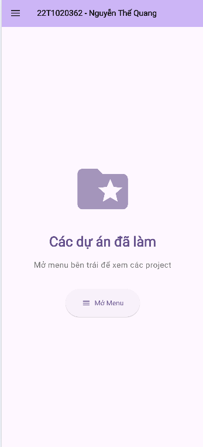  |

| BT1 - Mở đầu                                                           || BT2 - MyPlace                                                          |
| -----------------------------------------------------------------------|-| ----------------------------------------------------------------------|
| 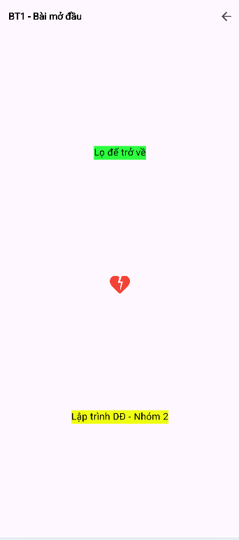 || 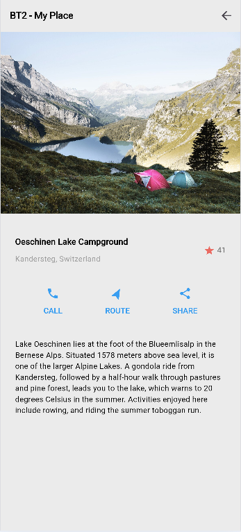 | 

| BT3 - MyClassroom                                                         || BT4 - GuideToLayout                                                       |
| --------------------------------------------------------------------------|-| -------------------------------------------------------------------------|
| 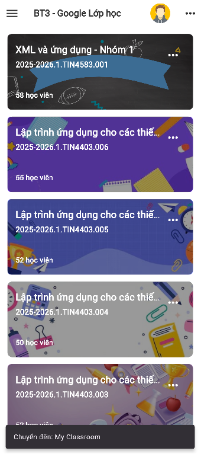 || 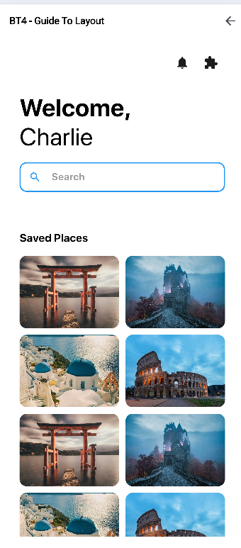 | 

| BT5 - CounterApp                                                          || BT6 - ColorChangeApp                                                  |
| --------------------------------------------------------------------------|-| ---------------------------------------------------------------------|
| 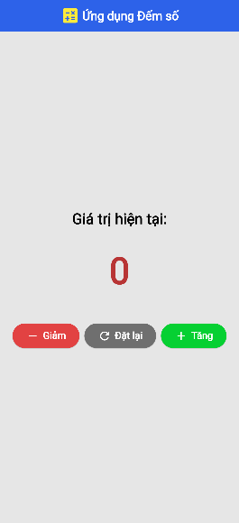     || 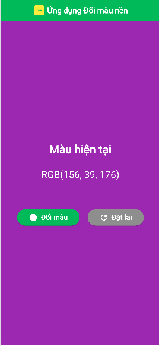 |

| BT7 - LoginForm                                                                   || BT8 - RegisterForm                                                                   |
| ----------------------------------------------------------------------------------|-| ------------------------------------------------------------------------------------|
| 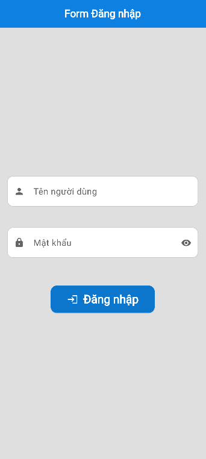 || 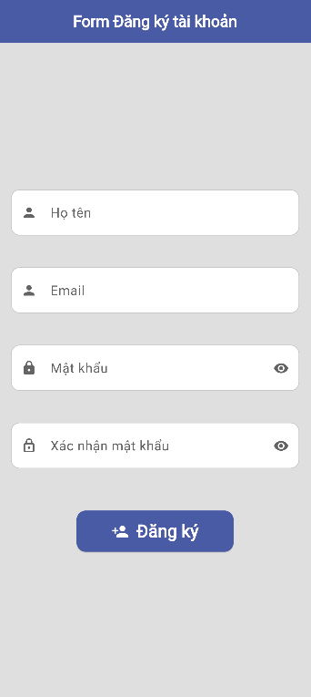 |

| BT9 - BMIForm                                                               || BT10 - FeedbackForm                                                           |
| ----------------------------------------------------------------------------|-| -----------------------------------------------------------------------------|
| 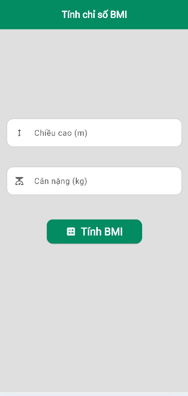 || 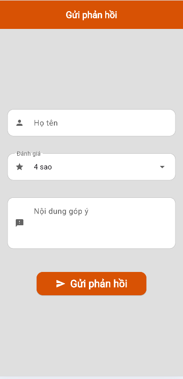 |

| BT11 - ApiExample                                                            || BT12 - NewsApp                                                                       |
| -----------------------------------------------------------------------------|-| ------------------------------------------------------------------------------------|
|  ||  |

| BT13 - ApiLoginForm                                                            |
| -------------------------------------------------------------------------------|
| 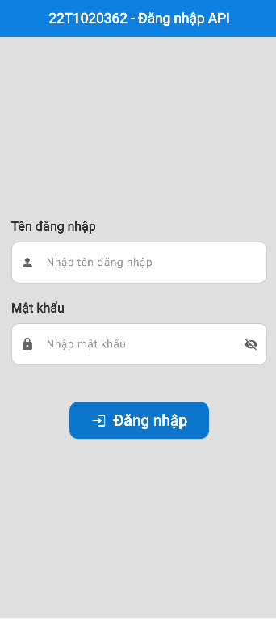  |

# Cách cài đặt (Windows 11)
- Cài: VS Code, Flutter, Dart (Bản mới nhất).
- Bước 1: Tải file zip trên link github về, hoặc Clone link Github.
- Bước 2: Giải nén file Zip trong thư mục nào đó trên máy, hoặc Clone link Github vào thư mục.
- Bước 3: Mở thư mục 22T1020362-GiuaKy/t1020362_midterm sau khi giải nén zip / Sau Clone trong VS Code, nơi thư mục được giải nén hoặc Clone.
- Bước 4: Mở file pubspec.yaml, Ctrl-S hoặc gõ "flutter pub get" trong Terminal để tải các thư viện phụ thuộc về.
- Bước 5: Chọn Run -> Run Without Debugging -> Device: Chrome hoặc Device: Giả lập Android để chạy code.

# Bảng theo dõi tiến độ
| Ngày                  | Công việc                                                                                          | Ghi chú                |
| --------------------- | -------------------------------------------------------------------------------------------------- | ---------------------- |
| 10/09/2025            | Bắt đầu môn học                                                                                    | Tải Flutter, VS Code   |
| 24/09 - 10/12/2025    | Làm các bài tập mà thầy giao, đẩy lên Gibhub                                                       | MySQL                  |
| 11-16/12/2025         | Làm code giữa kỳ để trình bày kết quả các bài tập, hoàn thiện README.md                            | CodeIgniter 4, MySQL   |

# Dự định tương lai
- [ ] Cập nhật cấu trúc các dự án con (Bài tập con), làm tối ưu và làm sạch code.
- [ ] Tối ưu cấu trúc code.
- [ ] UI : Thiết kế giao diện đẹp hơn.